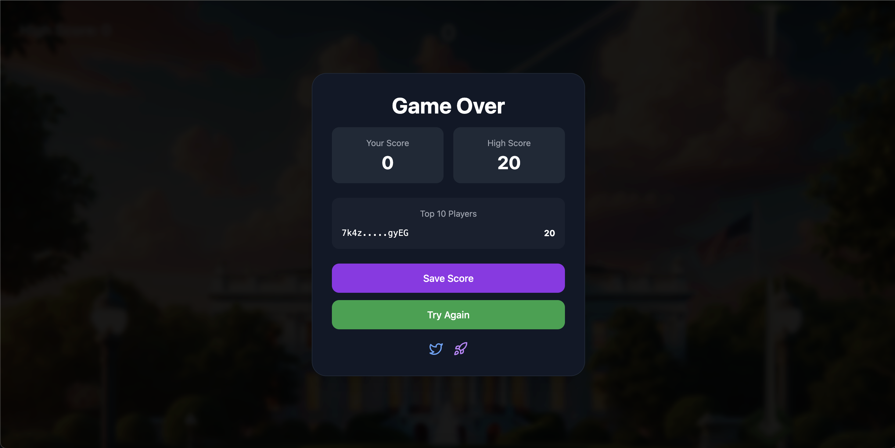

# Trump Minigame Initiative


## 🚀 Overview

**Trump Minigame Initiative** is an open-source framework designed to empower developers to create engaging Web3-enabled minigames with autonomous high score reporting. Leveraging blockchain technology, the framework ensures secure, transparent, and decentralized leaderboards, while the autonomous agent handles high score tracking and social media integrations, such as tweeting new high scores.

## 🎮 Features

- **Web3 Authentication:** Seamlessly integrate blockchain-based user authentication.
- **Autonomous High Score Reporting:** Automatically track and report the highest scores.
- **Decentralized Leaderboards:** Transparent and tamper-proof leaderboards powered by blockchain.
- **Social Media Integration:** Automatically tweet when new high scores are achieved.
- **Modular Framework:** Easily extendable to create a variety of minigames.
- **Responsive Design:** Optimized for both desktop and mobile browsers.

## 🛠️ Technologies Used

- **Backend:** Node.js, Express.js, Solidity (Smart Contracts)
- **Frontend:** React, Tailwind CSS
- **Blockchain:** Ethereum (Web3)
- **Database:** JSON file-based storage for simplicity
- **Others:** CORS, Lucide-React for icons

## 📂 Project Structure

```
HighScore.sol       build               package-lock.json  postcss.config.js  server           tailwind.config.js
README.md           node_modules        package.json       public             src
```

- **HighScore.sol:** Solidity smart contract for managing high scores.
- **build:** Compiled smart contracts.
- **node_modules:** Project dependencies.
- **package.json:** Project metadata and dependencies.
- **postcss.config.js & tailwind.config.js:** Configuration files for Tailwind CSS.
- **server:** Backend server code handling API requests and high score logic.
- **public:** Static assets for the frontend.
- **src:** React frontend source code.

## 🛠️ Installation

### Prerequisites

- **Node.js** (v14 or higher)
- **npm** or **yarn**
- **Git**

### Steps

1. **Clone the Repository**

   ```bash
   git clone https://github.com/yourusername/trump-minigame.git
   cd trump-minigame
   ```

2. **Install Dependencies**

   ```bash
   npm install
   # or
   yarn install
   ```

3. **Set Up Environment Variables**

   Create a `.env` file in the root directory and add necessary environment variables. Example:

   ```env
   PORT=3001
   CONTRACT_ADDRESS=0x52ezjYa79Jgh5UTpqyR1HQVyULi2H8EfEUV2pYEjpump
   ```

4. **Compile Smart Contracts**

   Ensure you have Solidity installed or use a tool like Hardhat or Truffle.

   ```bash
   # Example with Hardhat
   npx hardhat compile
   ```

5. **Run the Server**

   ```bash
   npm run server
   # or
   yarn server
   ```

6. **Start the Frontend**

   In a new terminal window:

   ```bash
   npm start
   # or
   yarn start
   ```

7. **Access the Application**

   Open your browser and navigate to `http://localhost:3000` to start playing.

## ⚙️ Usage

### Submitting a High Score

Send a `POST` request to `/api/scores` with the following JSON payload:

```json
{
  "score": 1500,
  "wallet": "0xYourEthereumWalletAddress"
}
```

### Fetching the Leaderboard

Send a `GET` request to `/api/leaderboard` to retrieve the top 10 high scores.

### Playing the Game

Interact with the frontend React application to start playing the minigame. Your high scores will be tracked and displayed on the leaderboard.

## 📜 API Endpoints

### `POST /api/scores`

**Description:** Submit a new score.

**Request Body:**

- `score` (number): The score achieved by the player.
- `wallet` (string): The player's Ethereum wallet address.

**Response:**

```json
{
  "success": true,
  "newGlobalHighScore": true,
  "personalBest": 1500,
  "globalHighScore": 1500
}
```

### `GET /api/leaderboard`

**Description:** Retrieve the top 10 high scores.

**Response:**

```json
{
  "leaderboard": [
    { "wallet": "0x12...34EF", "score": 2000 },
    { "wallet": "0x56...78GH", "score": 1800 },
    // ...
  ],
  "globalHighScore": 2000
}
```

## 📸 Screenshots


*Main screen of Trump Minigame*


*Leaderboard showcasing top scores*

## 🤝 Contributing

Contributions are what make the open-source community such an amazing place to learn, inspire, and create. Any contributions you make are **greatly appreciated**.

1. **Fork the Project**

2. **Create your Feature Branch**

   ```bash
   git checkout -b feature/AmazingFeature
   ```

3. **Commit your Changes**

   ```bash
   git commit -m "Add some AmazingFeature"
   ```

4. **Push to the Branch**

   ```bash
   git push origin feature/AmazingFeature
   ```

5. **Open a Pull Request**

## 📝 License

Distributed under the MIT License. See `LICENSE` for more information.

## 📫 Contact

- **Twitter:** [@trumpgameonsol](https://x.com/trumpgameonsol)
- **GitHub:** [antongo10](https://github.com/antongo10/flappytrump)
- **Website:** [pump.fun](https://pump.fun/coin/52ezjYa79Jgh5UTpqyR1HQVyULi2H8EfEUV2pYEjpump)

---

> **Note:** This project is a playful initiative and not endorsed by any political figures.

# Acknowledgments

- [Lucide-React](https://lucide.dev/) for the icon library.
- [Tailwind CSS](https://tailwindcss.com/) for the utility-first CSS framework.
- [Express.js](https://expressjs.com/) for the backend server framework.

---

Feel free to customize this README to better fit your project's unique aspects and requirements!
